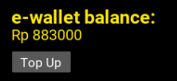

# PC GAME STORE

Application system about purchasing PC Game through PC application

## Prerequisite

Please read this Readme carefully

- Python 3.7
- Kivy
- SMTPLIB
- PyTest (Optional)

## How to run

```
python main.py
```

Optionally, to try the testing, do:
```
cd test
pytest -v
```


## Daftar Modul yand diimplementasikan

- 1 Autentikasi pengguna

    - 1.1 Login
        - 1.1.1 Mengisi form login
            - 
        - 1.1.2 Validasi login
            Tidak ada layar
        - 1.1.3 Pesan gagal login
            
    - 1.2 Register
        - 1.2.1 Mengisi form registrasi
            
        - 1.2.2 Validasi registrasi
            Tidak ada layar
        - 1.2.3 Pesan gagal registrasi
            
            
    - 1.3 Forgot password
        
        

- 2 Homepage
    - 2.1 Pengguna
        
        - 2.1.1 Menampilkan daftar game
            
        - 2.1.1.1 Filter
            Hanya diimplementasikan front end nya saja
            
        - 2.1.1.2 Search
            - Hanya diimplementasikan front end nya saja
            
        - 2.1.1.3 Menampilkan deskripsi game
            
        - 2.1.1.3.1 Membeli game
            
        - 2.1.1.3.1.1 Validasi saldo e-wallet
            - Tidak ada layar
        - 2.1.1.3.1.1.1 Menampilkan link download game
            
            
            
        - 2.1.1.3.1.2 Pesan gagal saldo tidak cukup
            
            
    - 2.1.2 Menampilkan saldo e-wallet
        - 
    - 2.1.4 Menampilkan profil
        
        - 2.1.4.1 Ganti password
            
            

- 3 Logout
    - Kembali ke modul Autentikasi Pengguna
    - 

## Daftar Realisasi Tabel Basis Data

- 1 Tabel Accounts
    - email
    - password
    - full_name
    - date_of_birth
    - nationality
    - phone_number
    - created_on
- 2 Tabel Game
    - nama_file
    - nama_game
    - ukuran
    - harga
    - deskripsi
    - os
    - processor
    - graphic
    - storage
    - link
- 3 Tabel Ewallet
    - email
    - saldo

## Responsibilities

- Jones Napoleon Autumn - 13518086
    - Modul utama bulk aplikasi
    - Modul login
    - Modul register
    - Modul forget password
    - Modul change password


- Inka Anindya Riyadi - 13518038
    - Modul menampilkan deskripsi game
    - Modul membeli game
    - Modul validasi saldo e-wallet
    - Modul menampilkan link download game
    - Modul menampilkan saldo
    - Modul pesan gagal saldo


- Stefanus Gusega Gunawan - 13518149
    - pytest
    - Modul menampilkan halaman profile


- Fritz Gerald Tjie - 13518065
    - pytest
    - CI/CD
    - Modul menampilkan daftar game


## Miscellaneous

- Untuk file yang telah dicapture dan dipasang di Readme, tidak berada di folder ```docs``` melainkan di folder ```asset/readme```

